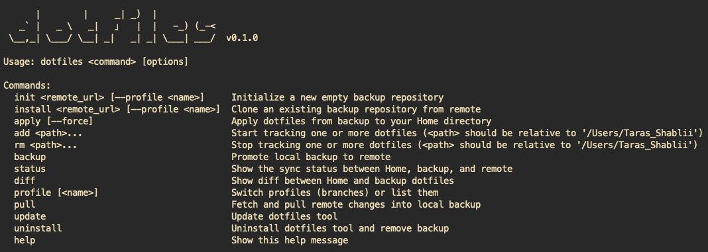
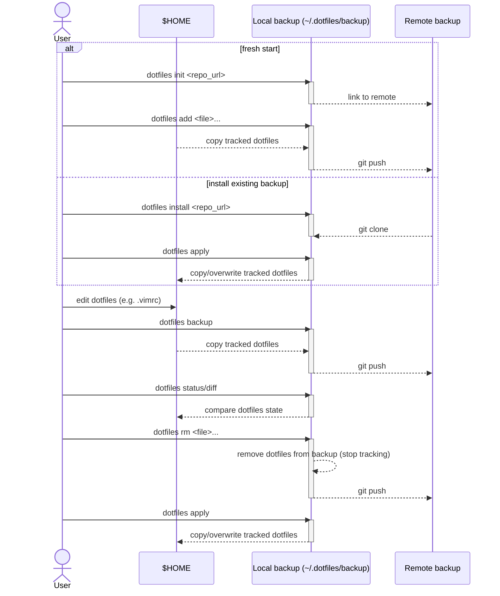
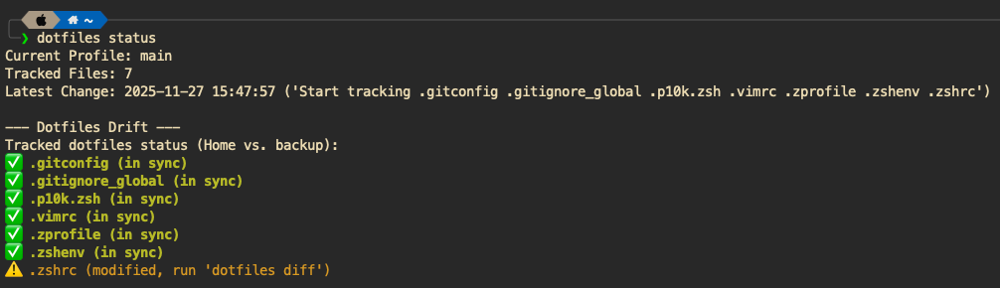

# dotfiles

A simple, snapshot-based CLI tool to back up, restore, or transfer your dotfiles.



# 🤔 What are dotfiles?

Dotfiles are the hidden configuration files in your \$HOME directory that start with a dot (e.g., `.bashrc`, `.vimrc`,
`.gitconfig`).
They control the look and feel of your terminal, your aliases, and your editor settings.
It takes time and effort through trials and errors to arrive at a cozy custom setup, so it makes sense to protect your
\$HOME from accidental changes or make a move to a new machine smooth and seamless.
Managing dotfiles allows you to:

1. Backup your personalized environment.
2. Sync your setup across multiple machines.
3. Restore your environment instantly on a fresh OS install or after an incident.

> *Note*: This tool was built out of sheer joy of learning. While robust enough for daily use, it opts for simplicity
> over complex features. If you need advanced dotfiles management, consider tools
> like [GNU Stow](https://www.gnu.org/software/stow/) or [YADM](https://yadm.io/). Make sure to check out this
> robust [Dotfiles guide](https://dotfiles.github.io/) for more insights. However, if you want a straightforward
> "snapshot-and-restore" workflow, you are in the right place.

# ⚙️ Snapshot Approach

Most dotfiles managers use symlinks to point your \$HOME files to a git repository.
This is powerful but can be fragile; deleting a file in one place might break it in another, and managing paths can get
messy.

This dotfiles tool takes a "Snapshot" approach:

- Your \$HOME directory is the **source of truth**. You edit your files there as usual.
- When you run `dotfiles backup`, the tool copies your tracked files into a local git repository (`~
  /.dotfiles/backup`) and pushes them to your remote.
- When you run `dotfiles apply`, it copies files from the backup back to your \$HOME directory.

This ensures that your backup repository never accidentally messes up your live environment without your explicit
command. Moreover, you are free to experiment with your \$HOME dotfiles while having a safe backup in case you need to
revert.

# 📦 Getting Started

## Installation

Prerequisites:

- macOS or Linux
- git

This command installs the CLI tool itself:

```shell
bash <(curl -fsSL https://raw.githubusercontent.com/tarasshablii/dotfiles/refs/heads/main/install)
```

## Fresh Setup

If you are starting from scratch, create an empty *private* repository on GitHub (or GitLab/Bitbucket) to back up your
configurations.

```shell
# Initialize the backup repo linked to your remote
dotfiles init git@github.com:username/my-dotfiles.git

# Start tracking files
dotfiles add .zshrc .vimrc .config/starship.toml

# Check status
dotfiles status
```

## Restore on New Machine

If you already have a repository managed by this tool and want to set up a new machine:

```shell
# Clone your configs and set up the local backup
dotfiles install git@github.com:username/my-dotfiles.git
```

Then, to apply those files to your actual \$HOME directory:

```shell
# DANGER: This will overwrite local files with the backup versions
dotfiles apply
```

# 📖 Usage Guide



## Tracking Files

- `dotfiles add <file>...`: Adds one or more files to the tracking list. The file must exist in your \$HOME directory.
- `dotfiles rm <file>...`: Stops tracking one or more files. (Does not delete it from your \$HOME dir).

## Syncing

- `dotfiles backup`: Copies the current state of tracked files from \$HOME -> Backup Repo -> Remote. This is the only
  command you will really need after setting things up. Edit your tracked dotfiles in /$HOME as you normally would,
  and occasionally run `dotfiles backup` to back up your changes and push to the remote.
- `dotfiles apply`: Copies files from Backup Repo -> \$HOME. Use this after a pull or on a new machine. DANGER: This
  will overwrite \$HOME dotfiles with the backup versions.
- `dotfiles pull`: Pulls changes from the remote backup into your local backup. Useful if you want to sync with your
  other machines.

## Safety & Drift

The tool is designed to prevent accidents.

- `dotfiles status`: Shows tracked files and the state of "drift." It tells you if your \$HOME dotfiles differ from
  backup.
- `dotfiles diff`: Drill down into line-by-line diffs between your \$HOME dotfiles and the backup.



## Profiles

Workflows often differ between personal and work machines. This tool uses git branches to manage isolated profiles.

```shell
# Switch to a 'work' profile (creates a new isolated branch if it doesn't exist)
dotfiles profile work

# List available profiles
dotfiles profile
```

> Note: Profiles are completely isolated. Switching profiles creates a fresh branch with an empty backup. You can
> maintain completely different sets of dotfiles for different contexts.

# 🔒 Secrets & Security

**Do not commit secrets (API keys, passwords) to your dotfiles.**

This tool copies files directly and does not provide any encryption yet. It is recommended to:

- Use a **private** github repository for your remote backup.
- **Ignore secrets**: if you track a folder like `.config/myapp/`, ensure `secrets.json` inside it is not added, or use
  environment variables instead.

# 🗑️ Uninstall

If you want to remove the tool and clean up:

```shell
dotfiles uninstall
```

This will remove the dotfiles command and offer to clean up your local backups at `~/.dotfiles`.

---
Built in 🇺🇦Ukraine with ❤️

Support our fight against russian invasion by donating to the [Come Back Alive Foundation](https://savelife.in.ua/en/)
